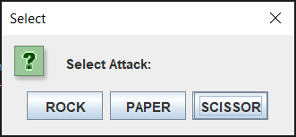
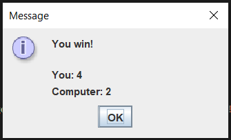
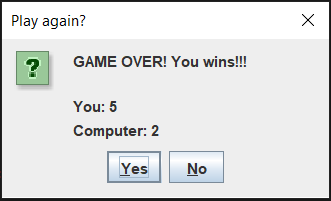

# java-oop-jack-n-poy
A simple rock paper scissor game (jack n' poy)  that demostrate basic Java OOP

### Features
 - 2 player (1 human, 1 computer)
 - first 5 score, wins
 - play again

### Screenshot

## LICENSE 
[Apache-2.0](https://www.apache.org/licenses/LICENSE-2.0)[@eru123](https://github.com/eru123)
